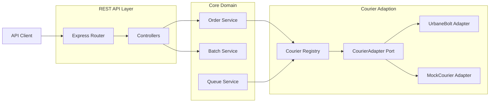
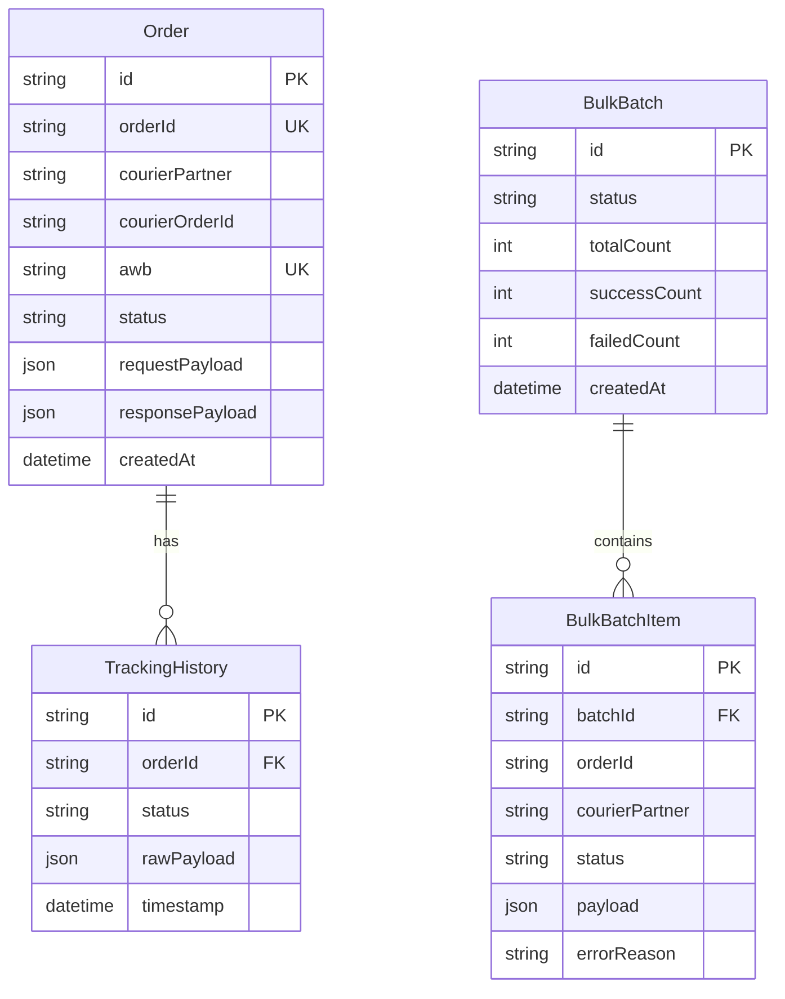

# Multi-Courier Integration Platform - System Design Document

This document details the architectural decisions, design patterns, database design, and key system trade-offs for the Multi-Courier Integration Platform.

---

## 1. Architectural Overview

The system is built using a **Modular Ports and Adapters (Hexagonal) Architecture**. The primary objective is to isolate core business rules (manifesting, tracking, cancellation, and bulk processing) from the concrete details of external third-party logistics APIs (UrbaneBolt, Delhivery, etc.).

### System Flow

---

## 2. Key Design Patterns Used

### 2.1 Adapter Pattern
Every courier partner integrates via a concrete class that implements the `CourierAdapter` interface:
* **The Port (Interface):** Defines unified methods: `createShipment()`, `trackShipment()`, and `cancelShipment()`.
* **The Adapters:** Implement mappings from our normalized internal payload (`NormalizedOrderPayload`) to the courier's proprietary payload format. It encapsulates:
  * Authentication lifecycle: Retrieving, caching, and auto-refreshing bearer tokens (e.g. UrbaneBolt token lifecycle).
  * Courier-specific error interception and mapping.

### 2.2 Strategy Registry (Factory) Pattern
To support dynamic runtime routing, a `CourierRegistry` class maintains an active map of all registered courier adapters. 
* Core services resolve adapters dynamically: `courierRegistry.get(courierPartner)`.
* **Adding a new courier:** Only requires creating a new adapter class implementing `CourierAdapter` and calling `courierRegistry.register('newcourier', new NewCourierAdapter())`. **No existing controllers, services, database models, or schemas need to be modified.**

---

## 3. Asynchronous Queue & Bulk Processing Design

To process bulk batches of up to 100 orders, we implement a **Transactional Outbox / Database-backed Job Queue** pattern using PostgreSQL.

### Workflow:
1. **API Ingestion:** The client posts up to 100 orders. The server opens a SQL transaction:
   - Inserts a `BulkBatch` record (Status: `PENDING`).
   - Inserts up to 100 `BulkBatchItem` records containing the raw payload.
2. **Accept Response:** The transaction commits, and the server immediately returns a `202 Accepted` response with the `batch_id`. The client is freed up in under 50ms.
3. **Background Processing:** A polling worker picks up tasks in chunks of `CONCURRENCY_LIMIT` (default 5):
   - It transactionally updates the items' state to `PROCESSING` to prevent duplicate processing by other worker threads (state lock).
   - Utilizes `p-limit` to execute requests concurrently, controlling API load.
   - Updates the item state to `SUCCESS` or `FAILED` with details.
   - Once all items in the batch are resolved, it marks the `BulkBatch` as `COMPLETED`.

---

## 4. Database Schema Design (Prisma / SQL)

---

## 5. Architectural Trade-offs & Decisions

### 5.1 DB-Backed Queue vs. Dedicated Message Broker (Kafka/RabbitMQ/Redis)
* **Kafka / RabbitMQ / Redis (BullMQ):** 
  * *Production Ideal:* In a production environment with high scale, we would ideally use a dedicated message broker (like Kafka or RabbitMQ) to decouple background workers and scale consumer instances independently.
* **Database-Backed Queue (Chosen for this Platform):**
  * *Why:*
    1. **ACID Transactional Consistency:** External brokers do not share transaction boundaries with SQL databases. If we push tasks to Kafka but the SQL write fails, the states drift. Using PostgreSQL itself as the queue allows us to ingest the bulk orders and enqueue the worker items in a **single database transaction**, guaranteeing exactly-once scheduling consistency.
    2. **Frictionless Local Execution:** A message broker requires setting up and running external services (e.g., Zookeeper, Kafka, or Redis). Using a DB-backed queue keeps project dependencies minimal, enabling reviewers to run the platform locally with just standard Node and PostgreSQL.
    3. **Transactional Locks:** Using table locks and status polling allows safe chunking and deduplication, preventing parallel execution race conditions on identical order IDs.

### 5.2 SQL (PostgreSQL) vs. Document DB (MongoDB)
* **MongoDB:** Naturally suited for storing unstructured/dynamic raw payload audits.
* **PostgreSQL (Chosen):** We chose PostgreSQL using `JSONB` columns for raw payload auditing.
  * *Why:* Logistics platforms require strict data consistency (e.g., prevent orphaned `TrackingHistory` records or duplicate order manifests). PostgreSQL provides robust foreign key integrity and strict unique constraints (crucial for idempotency on `order_id`), alongside efficient query indexing inside the `JSONB` columns.

### 5.3 On-the-fly Re-authentication
* To handle expired session tokens, adapters intercept `401 Unauthorized` responses. The adapter clears its internal cache, calls the login endpoint, fetches a fresh token, and retries the original request once. This prevents batch failures due to token expiry and isolates auth logistics entirely inside the adapter.
